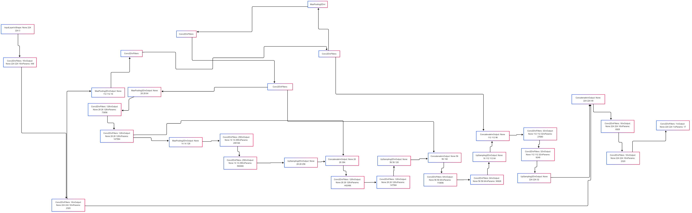

# U-Net-Brain-MRI-Segmentation


```
Brain-Tumor-Segmentation-Unet-EfficientNetB0/
├── data/
│   ├── images/                   # Original MRI scans (3064 images)
│   └── masks/                    # Corresponding segmentation masks
├── src/
│   ├── model/                    # Core model architecture
│   │   ├── unet_model.py         # U-Net with EfficientNetB0 encoder
│   │   └── dice_metric.py        # Dice coefficient implementation
│   ├── preprocessing/            # Data preparation
│   │   ├── resize_normalize.py   # Image resizing & normalization
│   │   └── augmentation.py       # Augmentation strategies
│   ├── training/                 # Model training scripts
│   │   ├── train_unet.py         # Main training script
│   │   └── early_stopping.py     # Early stopping callback
│   └── evaluation/               # Model assessment
│       ├── evaluate.py           # Test set evaluation
│       └── visualize_results.py  # Prediction visualization
├── deployment/                   # Production-ready components
│   ├── web_app/                  # User-facing interfaces
│   │   ├── app.py                # Main Flask application
│   │   ├── APIflask.py           # REST API endpoints
│   │   └── templates/            # HTML templates
│   └── streamlit/                # Alternative UI
│       └── flaskappStreamlit.py  # Streamlit application
├── trained_models/               # Serialized model weights
│   └── unet_efficientnetb0.h5    # Trained model
├── metrics/                      # Performance tracking
│   ├── training_metrics.csv      # Training history
│   ├── test_results/             # Evaluation outputs
│   │   ├── classification_report.txt
│   │   ├── confusion_matrix.png
│   │   └── dice_scores.txt
│   └── Brain-2025-04-24-200721.png  # Sample output
├── notebooks/                    # Experimental work
│   ├── Data_Exploration.ipynb
│   ├── Model_Prototyping.ipynb
│   └── Performance_Analysis.ipynb
├── tests/                        # Validation scripts
│   ├── test_preprocessing.py
│   └── test_metrics.py
├── configs/                      # Configuration management
│   └── params.yaml               # Hyperparameters
├── requirements.txt              # Python dependencies
└── README.md                     # Project documentation
# � Brain Tumor Segmentation Using U-Net with EfficientNetB0 Encoder
